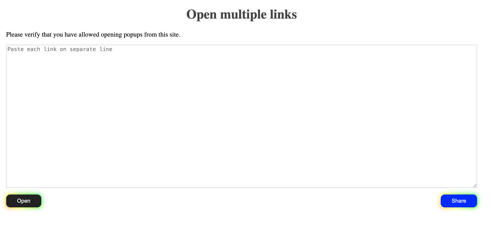

# open-multiple-links

This is a small page that allows you to open many tabs simultaneously and to share such a URL with others. 

Deployable through Docker or native through web server.

Zero dependencies 

